# Database Design: QC Microbiología CAR-T Lab

**Motor de BD:** MySQL 8.0+ / PostgreSQL 14+  
**Proyecto Stitch:** Formulario QC Microbiología (ID: `9876238392487790508`)  
**Fecha:** 2026-02-21  
**Generado por:** Antigravity Database Skill  

---

## Diagrama ER

```mermaid
erDiagram
    USUARIOS {
        INT id PK
        UUID uuid UK
        VARCHAR nombre
        VARCHAR apellido
        VARCHAR email UK
        VARCHAR password_hash
        ENUM rol
        BOOLEAN activo
        TIMESTAMP ultimo_acceso
    }

    PACIENTES {
        INT id PK
        UUID uuid UK
        VARCHAR nombre
        VARCHAR apellido
        DATE fecha_nacimiento
        VARCHAR numero_historia UK
        VARCHAR diagnostico
        TIMESTAMP deleted_at
    }

    LOTES_PRODUCCION {
        INT id PK
        VARCHAR lote_id UK
        INT id_paciente FK
        INT id_analista_responsable FK
        ENUM tipo_producto
        ENUM estado
        DATE fecha_inicio
        DATE fecha_fin_estimada
        DECIMAL viabilidad_final
    }

    ETAPAS_PROCESO {
        INT id PK
        VARCHAR nombre UK
        INT orden
        VARCHAR descripcion
        VARCHAR ref_sop
        INT duracion_estimada_horas
    }

    LOTE_ETAPAS {
        INT id PK
        INT id_lote FK
        INT id_etapa FK
        INT id_analista FK
        ENUM estado
        DECIMAL progreso_pct
        DATETIME fecha_inicio
        DATETIME fecha_fin
    }

    CHECKLIST_ITEMS {
        INT id PK
        INT id_etapa FK
        VARCHAR descripcion
        INT orden
        BOOLEAN obligatorio
    }

    LOTE_CHECKLIST {
        INT id PK
        INT id_lote_etapa FK
        INT id_checklist_item FK
        BOOLEAN completado
        INT id_usuario FK
        DATETIME fecha_completado
    }

    MUESTRAS {
        INT id PK
        VARCHAR codigo_muestra UK
        INT id_paciente FK
        INT id_lote FK
        VARCHAR tipo_muestra
        DATETIME fecha_recoleccion
    }

    PARAMETROS_QC {
        INT id PK
        VARCHAR nombre UK
        VARCHAR unidad
        DECIMAL spec_min
        DECIMAL spec_max
        VARCHAR metodo_analitico
        BOOLEAN activo
    }

    RESULTADOS_QC {
        INT id PK
        INT id_muestra FK
        INT id_lote FK
        INT id_parametro FK
        INT id_analista FK
        INT id_lote_reactivo FK
        DECIMAL valor
        ENUM resultado
        TEXT observaciones
        DATETIME fecha_analisis
    }

    REACTIVOS {
        INT id PK
        VARCHAR nombre UK
        VARCHAR fabricante
        VARCHAR unidad_medida
        INT stock_minimo
    }

    LOTES_REACTIVOS {
        INT id PK
        VARCHAR numero_lote
        INT id_reactivo FK
        DATE fecha_caducidad
        INT stock_actual
        ENUM estado
    }

    EQUIPOS {
        INT id PK
        VARCHAR nombre
        VARCHAR tipo
        VARCHAR ubicacion
        VARCHAR numero_serie UK
        ENUM estado_operativo
        DATE ultima_calibracion
        DATE proxima_calibracion
    }

    LECTURAS_AMBIENTALES {
        INT id PK
        INT id_equipo FK
        INT id_sala FK
        DECIMAL temperatura
        DECIMAL co2
        DECIMAL humedad
        INT particulas
        DATETIME timestamp_lectura
    }

    SALAS_LIMPIAS {
        INT id PK
        VARCHAR nombre UK
        VARCHAR clasificacion
        ENUM estado
    }

    ALERTAS_QC {
        INT id PK
        ENUM severidad
        VARCHAR mensaje
        ENUM origen
        INT id_equipo FK
        INT id_lote FK
        ENUM estado
        INT id_usuario_ack FK
        DATETIME fecha_ack
    }

    FIRMAS_ELECTRONICAS {
        INT id PK
        INT id_lote FK
        INT id_usuario FK
        ENUM tipo_firma
        ENUM decision
        TEXT comentarios
        VARCHAR hash_firma
        VARCHAR ip_address
        DATETIME fecha_firma
    }

    AUDIT_LOG {
        BIGINT id PK
        INT id_usuario FK
        VARCHAR accion
        VARCHAR tabla_afectada
        INT registro_id
        JSON datos_anteriores
        JSON datos_nuevos
        VARCHAR ip_address
        DATETIME fecha
    }

    AI_CHAT_HISTORY {
        INT id PK
        VARCHAR session_id
        VARCHAR page_context
        ENUM role
        TEXT content
        INT tokens_used
        TIMESTAMP created_at
    }

    PRUEBAS_IDENTIDAD_CELULAR {
        INT id PK
        INT id_lote FK
        ENUM etapa
        DECIMAL pct_car_positivo
        DECIMAL pct_cd3
        DECIMAL ratio_cd4_cd8
        DECIMAL viabilidad
    }

    PRUEBAS_POTENCIA {
        INT id PK
        INT id_lote FK
        ENUM tipo_ensayo
        DECIMAL ifn_gamma_pgml
        DECIMAL tnf_alpha_pgml
        ENUM resultado
    }

    QC_FISICOQUIMICO {
        INT id PK
        INT id_lote FK
        DECIMAL ph
        DECIMAL osmolalidad
        DECIMAL vcn
        ENUM resultado_global
    }

    CADENA_IDENTIDAD_CUSTODIA {
        INT id PK
        INT id_lote FK
        ENUM tipo_evento
        INT id_usuario_entrega FK
        INT id_usuario_recibe FK
        VARCHAR codigo_identificacion
    }

    REGISTROS_CRIOGENICOS {
        INT id PK
        INT id_lote FK
        ENUM tipo_evento
        DECIMAL temp_almacenamiento
        VARCHAR id_tanque_ln2
    }

    EVENTOS_ADVERSOS_CLINICOS {
        INT id PK
        INT id_lote FK
        INT id_paciente FK
        ENUM tipo_evento
        INT grado
        INT ice_score
    }

    ESTADISTICAS_PROCESO {
        INT id PK
        VARCHAR parametro
        VARCHAR periodo
        INT n
        DECIMAL media
        DECIMAL desv_std
        DECIMAL cp
        DECIMAL cpk
    }

    OBSERVACIONES_SPC {
        INT id PK
        INT id_lote FK
        VARCHAR parametro
        DECIMAL valor
        DECIMAL ucl
        DECIMAL lcl
        BOOLEAN es_outlier
    }

    USUARIOS ||--o{ LOTES_PRODUCCION : "responsable"
    USUARIOS ||--o{ LOTE_ETAPAS : "ejecuta"
    USUARIOS ||--o{ LOTE_CHECKLIST : "completa"
    USUARIOS ||--o{ RESULTADOS_QC : "registra"
    USUARIOS ||--o{ FIRMAS_ELECTRONICAS : "firma"
    USUARIOS ||--o{ ALERTAS_QC : "reconoce"
    USUARIOS ||--o{ AUDIT_LOG : "genera"
    USUARIOS ||--o{ CADENA_IDENTIDAD_CUSTODIA : "vínculo"

    PACIENTES ||--o{ LOTES_PRODUCCION : "tratamiento"
    PACIENTES ||--o{ MUESTRAS : "donante"
    PACIENTES ||--o{ EVENTOS_ADVERSOS_CLINICOS : "sufre"

    LOTES_PRODUCCION ||--o{ LOTE_ETAPAS : "progreso"
    LOTES_PRODUCCION ||--o{ MUESTRAS : "origen"
    LOTES_PRODUCCION ||--o{ RESULTADOS_QC : "calidad"
    LOTES_PRODUCCION ||--o{ FIRMAS_ELECTRONICAS : "aprobación"
    LOTES_PRODUCCION ||--o{ ALERTAS_QC : "incidencia"
    LOTES_PRODUCCION ||--o{ PRUEBAS_IDENTIDAD_CELULAR : "identidad"
    LOTES_PRODUCCION ||--o{ PRUEBAS_POTENCIA : "potencia"
    LOTES_PRODUCCION ||--o{ QC_FISICOQUIMICO : "pureza"
    LOTES_PRODUCCION ||--o{ CADENA_IDENTIDAD_CUSTODIA : "COI/COC"
    LOTES_PRODUCCION ||--o{ EVENTOS_ADVERSOS_CLINICOS : "seguimiento"
    LOTES_PRODUCCION ||--o{ OBSERVACIONES_SPC : "monitorización"

    ETAPAS_PROCESO ||--o{ LOTE_ETAPAS : "define"
    ETAPAS_PROCESO ||--o{ CHECKLIST_ITEMS : "contiene"

    LOTE_ETAPAS ||--o{ LOTE_CHECKLIST : "tracking"

    CHECKLIST_ITEMS ||--o{ LOTE_CHECKLIST : "instancia"

    MUESTRAS ||--o{ RESULTADOS_QC : "analizada"

    PARAMETROS_QC ||--o{ RESULTADOS_QC : "evalúa"

    REACTIVOS ||--o{ LOTES_REACTIVOS : "inventario"
    LOTES_REACTIVOS ||--o{ RESULTADOS_QC : "usado en"

    EQUIPOS ||--o{ LECTURAS_AMBIENTALES : "sensor"
    EQUIPOS ||--o{ ALERTAS_QC : "origen"

    SALAS_LIMPIAS ||--o{ LECTURAS_AMBIENTALES : "ubicación"
```

---

## Tablas

### USUARIOS
> Gestión de acceso y roles — CFR 21 Part 11

| Campo | Tipo | Restricciones | Descripción |
|---|---|---|---|
| id | `INT` | PK, AUTO_INCREMENT | ID interno |
| uuid | `CHAR(36)` | UNIQUE, NOT NULL | UUID público (nunca exponer IDs secuenciales) |
| nombre | `VARCHAR(100)` | NOT NULL | Nombre |
| apellido | `VARCHAR(100)` | NOT NULL | Apellido |
| email | `VARCHAR(150)` | UNIQUE, NOT NULL | Email institucional |
| password_hash | `VARCHAR(255)` | NOT NULL | Hash bcrypt de la contraseña |
| rol | `ENUM('qc_analyst','qc_supervisor','qualified_person','admin','readonly')` | NOT NULL | Rol en el sistema |
| activo | `BOOLEAN` | DEFAULT TRUE | Soft-enable/disable |
| ultimo_acceso | `DATETIME` | NULL | Último login exitoso |
| created_at | `TIMESTAMP` | DEFAULT NOW() | Alta |
| updated_at | `TIMESTAMP` | DEFAULT NOW() ON UPDATE NOW() | Última modificación |

---

### PACIENTES
> Datos del paciente que recibe terapia CAR-T

| Campo | Tipo | Restricciones | Descripción |
|---|---|---|---|
| id | `INT` | PK, AUTO_INCREMENT | ID interno |
| uuid | `CHAR(36)` | UNIQUE, NOT NULL | UUID público |
| nombre | `VARCHAR(100)` | NOT NULL | Nombre |
| apellido | `VARCHAR(100)` | NOT NULL | Apellido |
| fecha_nacimiento | `DATE` | NOT NULL | Fecha de nacimiento |
| numero_historia | `VARCHAR(50)` | UNIQUE, NOT NULL | Nº historia clínica |
| diagnostico | `VARCHAR(255)` | NULL | Diagnóstico principal |
| created_at | `TIMESTAMP` | DEFAULT NOW() | Registro |
| updated_at | `TIMESTAMP` | DEFAULT NOW() ON UPDATE NOW() | Modificación |
| deleted_at | `DATETIME` | NULL | Soft delete |

---

### LOTES_PRODUCCION
> Lotes de fabricación CAR-T (entidad central del sistema)

| Campo | Tipo | Restricciones | Descripción |
|---|---|---|---|
| id | `INT` | PK, AUTO_INCREMENT | ID interno |
| lote_id | `VARCHAR(30)` | UNIQUE, NOT NULL | Código de lote (ej: `CART-2026-0042`) |
| id_paciente | `INT` | FK → PACIENTES, NOT NULL | Paciente destinatario |
| id_analista_responsable | `INT` | FK → USUARIOS, NOT NULL | Analista responsable principal |
| tipo_producto | `ENUM('CAR-T_CD19','CAR-T_BCMA','CAR-T_CD22','otro')` | NOT NULL | Tipo de terapia |
| estado | `ENUM('en_proceso','qc_pendiente','aprobado','rechazado','en_hold','enviado')` | DEFAULT 'en_proceso' | Estado global del lote |
| fecha_inicio | `DATE` | NOT NULL | Inicio de fabricación |
| fecha_fin_estimada | `DATE` | NULL | Fecha estimada de release |
| fecha_fin_real | `DATE` | NULL | Fecha real de release |
| viabilidad_final | `DECIMAL(5,2)` | NULL | % viabilidad final (0–100) |
| created_at | `TIMESTAMP` | DEFAULT NOW() | Registro |
| updated_at | `TIMESTAMP` | DEFAULT NOW() ON UPDATE NOW() | Modificación |

---

### ETAPAS_PROCESO
> Catálogo de las 6 etapas de fabricación CAR-T

| Campo | Tipo | Restricciones | Descripción |
|---|---|---|---|
| id | `INT` | PK, AUTO_INCREMENT | ID |
| nombre | `VARCHAR(80)` | UNIQUE, NOT NULL | Nombre de la etapa |
| orden | `INT` | NOT NULL | Orden secuencial (1–6) |
| descripcion | `TEXT` | NULL | Descripción de la etapa |
| ref_sop | `VARCHAR(50)` | NULL | Referencia al SOP (ej: `SOP-CART-004`) |
| duracion_estimada_horas | `INT` | NULL | Duración estimada en horas |
| created_at | `TIMESTAMP` | DEFAULT NOW() | Registro |

---

### LOTE_ETAPAS
> Progreso de cada lote a través de cada etapa (pantalla Workflow)

| Campo | Tipo | Restricciones | Descripción |
|---|---|---|---|
| id | `INT` | PK, AUTO_INCREMENT | ID |
| id_lote | `INT` | FK → LOTES_PRODUCCION, NOT NULL | Lote |
| id_etapa | `INT` | FK → ETAPAS_PROCESO, NOT NULL | Etapa |
| id_analista | `INT` | FK → USUARIOS, NOT NULL | Analista que ejecuta |
| estado | `ENUM('pendiente','en_progreso','completada','en_hold')` | DEFAULT 'pendiente' | Estado de la etapa para este lote |
| progreso_pct | `DECIMAL(5,2)` | DEFAULT 0 | Porcentaje de avance (0–100) |
| fecha_inicio | `DATETIME` | NULL | Inicio real |
| fecha_fin | `DATETIME` | NULL | Fin real |
| observaciones | `TEXT` | NULL | Notas |
| created_at | `TIMESTAMP` | DEFAULT NOW() | Registro |
| updated_at | `TIMESTAMP` | DEFAULT NOW() ON UPDATE NOW() | Modificación |

> **Constraint:** UNIQUE(id_lote, id_etapa)

---

### CHECKLIST_ITEMS
> Ítems del checklist por etapa (catálogo)

| Campo | Tipo | Restricciones | Descripción |
|---|---|---|---|
| id | `INT` | PK, AUTO_INCREMENT | ID |
| id_etapa | `INT` | FK → ETAPAS_PROCESO, NOT NULL | Etapa a la que pertenece |
| descripcion | `VARCHAR(255)` | NOT NULL | Texto del ítem |
| orden | `INT` | NOT NULL | Orden de aparición |
| obligatorio | `BOOLEAN` | DEFAULT TRUE | ¿Es obligatorio para avanzar? |
| created_at | `TIMESTAMP` | DEFAULT NOW() | Registro |

---

### LOTE_CHECKLIST
> Estado de cada checklist-item para un lote-etapa específico

| Campo | Tipo | Restricciones | Descripción |
|---|---|---|---|
| id | `INT` | PK, AUTO_INCREMENT | ID |
| id_lote_etapa | `INT` | FK → LOTE_ETAPAS, NOT NULL | Lote-etapa |
| id_checklist_item | `INT` | FK → CHECKLIST_ITEMS, NOT NULL | Ítem del checklist |
| completado | `BOOLEAN` | DEFAULT FALSE | ¿Se completó? |
| id_usuario | `INT` | FK → USUARIOS, NULL | Quién lo completó |
| fecha_completado | `DATETIME` | NULL | Cuándo se completó |
| created_at | `TIMESTAMP` | DEFAULT NOW() | Registro |

> **Constraint:** UNIQUE(id_lote_etapa, id_checklist_item)

---

### MUESTRAS
> Muestras biológicas vinculadas a paciente y lote

| Campo | Tipo | Restricciones | Descripción |
|---|---|---|---|
| id | `INT` | PK, AUTO_INCREMENT | ID |
| codigo_muestra | `VARCHAR(50)` | UNIQUE, NOT NULL | Código de trazabilidad |
| id_paciente | `INT` | FK → PACIENTES, NOT NULL | Paciente |
| id_lote | `INT` | FK → LOTES_PRODUCCION, NULL | Lote CAR-T asociado |
| tipo_muestra | `ENUM('aferesis','sangre_periferica','producto_intermedio','producto_final','retencion')` | NOT NULL | Tipo de muestra |
| fecha_recoleccion | `DATETIME` | NOT NULL | Fecha/hora de recolección |
| observaciones | `TEXT` | NULL | Notas |
| created_at | `TIMESTAMP` | DEFAULT NOW() | Registro |
| updated_at | `TIMESTAMP` | DEFAULT NOW() ON UPDATE NOW() | Modificación |

---

### PARAMETROS_QC
> Catálogo de parámetros de control de calidad (pantalla Firma Electrónica)

| Campo | Tipo | Restricciones | Descripción |
|---|---|---|---|
| id | `INT` | PK, AUTO_INCREMENT | ID |
| nombre | `VARCHAR(100)` | UNIQUE, NOT NULL | Nombre del parámetro |
| unidad | `VARCHAR(30)` | NOT NULL | Unidad de medida |
| spec_min | `DECIMAL(10,4)` | NULL | Especificación mínima |
| spec_max | `DECIMAL(10,4)` | NULL | Especificación máxima |
| metodo_analitico | `VARCHAR(100)` | NULL | Método/técnica de análisis |
| activo | `BOOLEAN` | DEFAULT TRUE | ¿Está activo? |
| created_at | `TIMESTAMP` | DEFAULT NOW() | Registro |

---

### RESULTADOS_QC
> Resultados de análisis de calidad por muestra/lote

| Campo | Tipo | Restricciones | Descripción |
|---|---|---|---|
| id | `INT` | PK, AUTO_INCREMENT | ID |
| id_muestra | `INT` | FK → MUESTRAS, NOT NULL | Muestra analizada |
| id_lote | `INT` | FK → LOTES_PRODUCCION, NOT NULL | Lote de producción |
| id_parametro | `INT` | FK → PARAMETROS_QC, NOT NULL | Parámetro evaluado |
| id_analista | `INT` | FK → USUARIOS, NOT NULL | Analista que realizó el análisis |
| id_lote_reactivo | `INT` | FK → LOTES_REACTIVOS, NULL | Lote de reactivo usado |
| valor | `DECIMAL(10,4)` | NOT NULL | Valor numérico obtenido |
| resultado | `ENUM('PASS','FAIL','OOS','pendiente')` | DEFAULT 'pendiente' | Resultado vs especificación |
| observaciones | `TEXT` | NULL | Notas |
| fecha_analisis | `DATETIME` | NOT NULL | Fecha/hora del análisis |
| created_at | `TIMESTAMP` | DEFAULT NOW() | Registro |
| updated_at | `TIMESTAMP` | DEFAULT NOW() ON UPDATE NOW() | Modificación |

---

### REACTIVOS
> Catálogo de reactivos del laboratorio (pantalla Inventario)

| Campo | Tipo | Restricciones | Descripción |
|---|---|---|---|
| id | `INT` | PK, AUTO_INCREMENT | ID |
| nombre | `VARCHAR(150)` | UNIQUE, NOT NULL | Nombre del reactivo |
| fabricante | `VARCHAR(100)` | NOT NULL | Fabricante |
| catalogo | `VARCHAR(50)` | NULL | Nº de catálogo |
| unidad_medida | `VARCHAR(20)` | NOT NULL | ml, mg, unidades, etc. |
| stock_minimo | `INT` | NOT NULL DEFAULT 5 | Umbral de alerta de stock |
| condicion_almacenamiento | `VARCHAR(100)` | NULL | Ej: "2–8°C", "-20°C" |
| activo | `BOOLEAN` | DEFAULT TRUE | ¿Se usa actualmente? |
| created_at | `TIMESTAMP` | DEFAULT NOW() | Registro |
| updated_at | `TIMESTAMP` | DEFAULT NOW() ON UPDATE NOW() | Modificación |

---

### LOTES_REACTIVOS
> Lotes individuales de cada reactivo con control de stock y caducidad

| Campo | Tipo | Restricciones | Descripción |
|---|---|---|---|
| id | `INT` | PK, AUTO_INCREMENT | ID |
| numero_lote | `VARCHAR(50)` | NOT NULL | Nº de lote del fabricante |
| id_reactivo | `INT` | FK → REACTIVOS, NOT NULL | Reactivo padre |
| fecha_recepcion | `DATE` | NOT NULL | Fecha de recepción |
| fecha_caducidad | `DATE` | NOT NULL | Fecha de vencimiento |
| stock_actual | `INT` | NOT NULL DEFAULT 0 | Unidades disponibles |
| estado | `ENUM('disponible','agotado','caducado','cuarentena')` | DEFAULT 'disponible' | Estado del lote |
| certificado_analisis | `VARCHAR(255)` | NULL | Ruta o URL al CoA del proveedor |
| created_at | `TIMESTAMP` | DEFAULT NOW() | Registro |
| updated_at | `TIMESTAMP` | DEFAULT NOW() ON UPDATE NOW() | Modificación |

---

### EQUIPOS
> Equipos del laboratorio (pantalla Monitor de Sistema)

| Campo | Tipo | Restricciones | Descripción |
|---|---|---|---|
| id | `INT` | PK, AUTO_INCREMENT | ID |
| nombre | `VARCHAR(100)` | NOT NULL | Nombre del equipo |
| tipo | `ENUM('incubadora','bsc_hood','centrifuga','crioalmacenamiento','sensor_ambiental','otro')` | NOT NULL | Tipo |
| ubicacion | `VARCHAR(100)` | NULL | Ubicación física |
| id_sala | `INT` | FK → SALAS_LIMPIAS, NULL | Sala donde se ubica |
| numero_serie | `VARCHAR(100)` | UNIQUE | Nº de serie |
| estado_operativo | `ENUM('operativo','mantenimiento','alarma','fuera_servicio')` | DEFAULT 'operativo' | Estado actual |
| ultima_calibracion | `DATE` | NULL | Última calibración |
| proxima_calibracion | `DATE` | NULL | Próxima calibración programada |
| created_at | `TIMESTAMP` | DEFAULT NOW() | Registro |
| updated_at | `TIMESTAMP` | DEFAULT NOW() ON UPDATE NOW() | Modificación |

---

### SALAS_LIMPIAS
> Salas limpias del laboratorio (mapa en Monitor de Sistema)

| Campo | Tipo | Restricciones | Descripción |
|---|---|---|---|
| id | `INT` | PK, AUTO_INCREMENT | ID |
| nombre | `VARCHAR(80)` | UNIQUE, NOT NULL | Nombre (ej: "Sala A - GMP") |
| clasificacion | `ENUM('ISO_5','ISO_7','ISO_8','no_clasificada')` | NOT NULL | Clasificación ISO |
| estado | `ENUM('operativa','mantenimiento','fuera_servicio')` | DEFAULT 'operativa' | Estado actual |
| created_at | `TIMESTAMP` | DEFAULT NOW() | Registro |

---

### LECTURAS_AMBIENTALES
> Registros de sensores ambientales (pantalla Monitor de Sistema)

| Campo | Tipo | Restricciones | Descripción |
|---|---|---|---|
| id | `BIGINT` | PK, AUTO_INCREMENT | ID (alto volumen) |
| id_equipo | `INT` | FK → EQUIPOS, NOT NULL | Sensor/equipo que la genera |
| id_sala | `INT` | FK → SALAS_LIMPIAS, NOT NULL | Sala monitoreada |
| temperatura | `DECIMAL(5,2)` | NULL | Temperatura °C |
| co2_pct | `DECIMAL(5,2)` | NULL | CO₂ porcentaje |
| humedad_pct | `DECIMAL(5,2)` | NULL | Humedad relativa % |
| particulas | `INT` | NULL | Conteo de partículas /m³ |
| timestamp_lectura | `DATETIME` | NOT NULL | Momento de la lectura |
| created_at | `TIMESTAMP` | DEFAULT NOW() | Registro |

> **Nota:** Tabla de alto volumen. Particionar por `timestamp_lectura` en producción.

---

### ALERTAS_QC
> Alertas del sistema con severidad y trazabilidad

| Campo | Tipo | Restricciones | Descripción |
|---|---|---|---|
| id | `INT` | PK, AUTO_INCREMENT | ID |
| severidad | `ENUM('info','warning','critical')` | NOT NULL | Nivel de severidad |
| mensaje | `VARCHAR(500)` | NOT NULL | Descripción de la alerta |
| origen | `ENUM('ambiental','equipo','qc_resultado','inventario','sistema')` | NOT NULL | Origen de la alerta |
| id_equipo | `INT` | FK → EQUIPOS, NULL | Equipo involucrado |
| id_lote | `INT` | FK → LOTES_PRODUCCION, NULL | Lote afectado |
| estado | `ENUM('activa','reconocida','resuelta')` | DEFAULT 'activa' | Estado de la alerta |
| id_usuario_ack | `INT` | FK → USUARIOS, NULL | Quién la reconoció |
| fecha_ack | `DATETIME` | NULL | Cuándo se reconoció |
| created_at | `TIMESTAMP` | DEFAULT NOW() | Generada |

---

### FIRMAS_ELECTRONICAS
> Firmas digitales CFR 21 Part 11 (pantalla Firma Electrónica)

| Campo | Tipo | Restricciones | Descripción |
|---|---|---|---|
| id | `INT` | PK, AUTO_INCREMENT | ID |
| id_lote | `INT` | FK → LOTES_PRODUCCION, NOT NULL | Lote firmado |
| id_usuario | `INT` | FK → USUARIOS, NOT NULL | Firmante |
| tipo_firma | `ENUM('qc_analyst','qc_supervisor','qualified_person')` | NOT NULL | Rol del firmante |
| decision | `ENUM('aprobado','rechazado','revision_solicitada')` | NOT NULL | Decisión |
| comentarios | `TEXT` | NULL | Comentarios del firmante |
| hash_firma | `VARCHAR(128)` | NOT NULL | SHA-512 hash de la firma |
| ip_address | `VARCHAR(45)` | NOT NULL | IP del cliente |
| user_agent | `VARCHAR(255)` | NULL | Navegador/dispositivo |
| fecha_firma | `DATETIME` | NOT NULL | Momento exacto de la firma |
| created_at | `TIMESTAMP` | DEFAULT NOW() | Registro |

> **Constraint:** UNIQUE(id_lote, tipo_firma) — Solo una firma por rol por lote.

---

### AUDIT_LOG
> Registro de auditoría completo — CFR 21 Part 11

| Campo | Tipo | Restricciones | Descripción |
|---|---|---|---|
| id | `BIGINT` | PK, AUTO_INCREMENT | ID (alto volumen) |
| id_usuario | `INT` | FK → USUARIOS, NULL | Usuario que realizó la acción |
| accion | `ENUM('INSERT','UPDATE','DELETE','LOGIN','LOGOUT','SIGN','EXPORT')` | NOT NULL | Tipo de acción |
| tabla_afectada | `VARCHAR(80)` | NOT NULL | Tabla sobre la que se actuó |
| registro_id | `INT` | NULL | ID del registro afectado |
| datos_anteriores | `JSON` | NULL | Estado anterior (para UPDATEs) |
| datos_nuevos | `JSON` | NULL | Estado nuevo |
| ip_address | `VARCHAR(45)` | NULL | IP del cliente |
| fecha | `DATETIME` | NOT NULL DEFAULT NOW() | Timestamp de la acción |

---

## Relaciones (Foreign Keys)

| FK | Desde → Hacia | Cardinalidad | ON DELETE |
|---|---|---|---|
| `lotes_produccion.id_paciente` | → `pacientes.id` | 1:N | RESTRICT |
| `lotes_produccion.id_analista_responsable` | → `usuarios.id` | 1:N | RESTRICT |
| `lote_etapas.id_lote` | → `lotes_produccion.id` | 1:N | CASCADE |
| `lote_etapas.id_etapa` | → `etapas_proceso.id` | 1:N | RESTRICT |
| `lote_etapas.id_analista` | → `usuarios.id` | 1:N | RESTRICT |
| `checklist_items.id_etapa` | → `etapas_proceso.id` | 1:N | CASCADE |
| `lote_checklist.id_lote_etapa` | → `lote_etapas.id` | 1:N | CASCADE |
| `lote_checklist.id_checklist_item` | → `checklist_items.id` | 1:N | RESTRICT |
| `lote_checklist.id_usuario` | → `usuarios.id` | 1:N | SET NULL |
| `muestras.id_paciente` | → `pacientes.id` | 1:N | RESTRICT |
| `muestras.id_lote` | → `lotes_produccion.id` | 1:N | SET NULL |
| `resultados_qc.id_muestra` | → `muestras.id` | 1:N | RESTRICT |
| `resultados_qc.id_lote` | → `lotes_produccion.id` | 1:N | RESTRICT |
| `resultados_qc.id_parametro` | → `parametros_qc.id` | 1:N | RESTRICT |
| `resultados_qc.id_analista` | → `usuarios.id` | 1:N | RESTRICT |
| `resultados_qc.id_lote_reactivo` | → `lotes_reactivos.id` | 1:N | SET NULL |
| `lotes_reactivos.id_reactivo` | → `reactivos.id` | 1:N | RESTRICT |
| `equipos.id_sala` | → `salas_limpias.id` | 1:N | SET NULL |
| `lecturas_ambientales.id_equipo` | → `equipos.id` | 1:N | RESTRICT |
| `lecturas_ambientales.id_sala` | → `salas_limpias.id` | 1:N | RESTRICT |
| `alertas_qc.id_equipo` | → `equipos.id` | 1:N | SET NULL |
| `alertas_qc.id_lote` | → `lotes_produccion.id` | 1:N | SET NULL |
| `alertas_qc.id_usuario_ack` | → `usuarios.id` | 1:N | SET NULL |
| `firmas_electronicas.id_lote` | → `lotes_produccion.id` | 1:N | RESTRICT |
| `firmas_electronicas.id_usuario` | → `usuarios.id` | 1:N | RESTRICT |
| `audit_log.id_usuario` | → `usuarios.id` | 1:N | SET NULL |

---

## Índices Estratégicos

| Tabla | Índice | Campos | Razón |
|---|---|---|---|
| lotes_produccion | `idx_lotes_estado` | `estado` | Filtro Dashboard/Analytics |
| lotes_produccion | `idx_lotes_paciente` | `id_paciente` | Join frecuente |
| lotes_produccion | `idx_lotes_fechas` | `fecha_inicio, fecha_fin_real` | Rangos temporales |
| lote_etapas | `idx_le_lote_etapa` | `id_lote, id_etapa` | UNIQUE constraint + búsqueda |
| resultados_qc | `idx_rqc_lote` | `id_lote` | Filtros por lote |
| resultados_qc | `idx_rqc_resultado` | `resultado` | Filtro PASS/FAIL |
| resultados_qc | `idx_rqc_fecha` | `fecha_analisis` | Reportes temporales |
| lotes_reactivos | `idx_lr_caducidad` | `fecha_caducidad` | Alertas de vencimiento |
| lotes_reactivos | `idx_lr_estado` | `estado` | Filtro inventario |
| lecturas_ambientales | `idx_la_timestamp` | `timestamp_lectura` | Series temporales |
| lecturas_ambientales | `idx_la_sala` | `id_sala, timestamp_lectura` | Lecturas por sala |
| alertas_qc | `idx_alertas_estado` | `estado` | Alertas activas |
| alertas_qc | `idx_alertas_severidad` | `severidad, estado` | Filtro compuesto |
| firmas_electronicas | `idx_firmas_lote` | `id_lote` | Cadena de aprobación |
| audit_log | `idx_audit_fecha` | `fecha` | Consultas históricas |
| audit_log | `idx_audit_tabla` | `tabla_afectada, registro_id` | Trazabilidad por registro |

---

### AI_CHAT_HISTORY (Tabla 18)
> Historial de conversaciones con Gemini

| Campo | Tipo | Restricciones | Descripción |
|---|---|---|---|
| id | `INT` | PK | - |
| session_id | `VARCHAR` | NOT NULL | ID de sesión |
| content | `TEXT` | NOT NULL | Mensaje |

---

### PRUEBAS_IDENTIDAD_CELULAR (Tabla 19)
> Citometría: %CAR+, CD3, CD4:CD8, viabilidad

| Campo | Tipo | Restricciones | Descripción |
|---|---|---|---|
| id | `INT` | PK | - |
| id_lote | `INT` | FK | Lote asociado |
| pct_car_positivo | `DECIMAL` | - | % células CAR+ |
| pct_cd3 | `DECIMAL` | - | % linfocitos T |
| viabilidad | `DECIMAL` | - | % viabilidad celular |

---

### PRUEBAS_POTENCIA (Tabla 20)
> Ensayos de citotoxicidad y secreción de citoquinas

| Campo | Tipo | Restricciones | Descripción |
|---|---|---|---|
| id | `INT` | PK | - |
| id_lote | `INT` | FK | Lote asociado |
| ifn_gamma_pgml | `DECIMAL` | - | Secreción IFN-γ |
| il2_pgml | `DECIMAL` | - | Secreción IL-2 |

---

### QC_FISICOQUIMICO (Tabla 21)
> Atributos críticos de calidad (pH, VCN, Micoplasma)

| Campo | Tipo | Restricciones | Descripción |
|---|---|---|---|
| id | `INT` | PK | - |
| id_lote | `INT` | FK | Lote asociado |
| ph | `DECIMAL` | - | 6.0 - 7.5 |
| vcn | `DECIMAL` | - | Vector Copy Number |

---

### CADENA_IDENTIDAD_CUSTODIA (Tabla 22)
> COI/COC: Trazabilidad completa de transferencias

| Campo | Tipo | Restricciones | Descripción |
|---|---|---|---|
| id | `INT` | PK | - |
| id_lote | `INT` | FK | Lote asociado |
| tipo_evento | `ENUM` | NOT NULL | Proceso COI/COC |
| id_usuario_entrega | `INT` | FK | 2-person rule |
| id_usuario_recibe | `INT` | FK | 2-person rule |

---

### REGISTROS_CRIOGENICOS (Tabla 23)
> Rampas de congelación y almacenamiento LN2

| Campo | Tipo | Restricciones | Descripción |
|---|---|---|---|
| id | `INT` | PK | - |
| id_lote | `INT` | FK | Lote asociado |
| temp_almacenamiento | `DECIMAL` | - | Temperatura °C |

---

### EVENTOS_ADVERSOS_CLINICOS (Tabla 24)
> Farmacovigilancia post-infusión (CRS/ICANS)

| Campo | Tipo | Restricciones | Descripción |
|---|---|---|---|
| id | `INT` | PK | - |
| id_lote | `INT` | FK | Lote asociado |
| id_paciente | `INT` | FK | Paciente |
| grado | `INT` | 1-4 | Severidad ASTCT |
| ice_score | `INT` | 0-10 | Estado neurológico |

---

### ESTADISTICAS_PROCESO (Tabla 25)
> Métricas agregadas de capacidad y tendencia

| Campo | Tipo | Restricciones | Descripción |
|---|---|---|---|
| id | `INT` | PK | - |
| parametro | `VARCHAR` | NOT NULL | Parámetro analizado |
| periodo | `VARCHAR` | NOT NULL | Intervalo temporal |
| cp | `DECIMAL` | - | Capacidad potencial |
| cpk | `DECIMAL` | - | Capacidad real (centrada) |

---

### OBSERVACIONES_SPC (Tabla 26)
> Datos individuales para cartas de control Shewhart

| Campo | Tipo | Restricciones | Descripción |
|---|---|---|---|
| id | `INT` | PK | - |
| id_lote | `INT` | FK | Lote asociado |
| valor | `DECIMAL` | NOT NULL | Valor observado |
| ucl | `DECIMAL` | - | Upper Control Limit |
| lcl | `DECIMAL` | - | Lower Control Limit |
| es_outlier | `BOOLEAN` | - | Alerta desviación |

---

## Cobertura por Pantalla

| Pantalla Desktop | Tablas Involucradas |
|---|---|
| **Formulario QC** | `muestras`, `resultados_qc`, `parametros_qc`, `lotes_produccion`, `lotes_reactivos` |
| **Workflow CAR-T** | `lotes_produccion`, `etapas_proceso`, `lote_etapas`, `lote_checklist` |
| **Monitor de Sistema** | `equipos`, `salas_limpias`, `lecturas_ambientales`, `alertas_qc` |
| **Firma Electrónica** | `firmas_electronicas`, `lotes_produccion`, `resultados_qc`, `parametros_qc` |
| **Analíticas QC (SPC)** | `estadisticas_proceso`, `observaciones_spc`, `resultados_qc`, `lotes_produccion` |
| **QC Release (GMP)** | `pruebas_identidad_celular`, `pruebas_potencia`, `qc_fisicoquimico`, `firmas_electronicas` |
| **Cadena Identidad (COI)** | `cadena_identidad_custodia`, `registros_criogenicos`, `pacientes` |
| **Monitor Post-Infusión** | `eventos_adversos_clinicos`, `pacientes`, `lotes_produccion` |
| **Chat IA Gemini** | `ai_chat_history`, `usuarios` |
