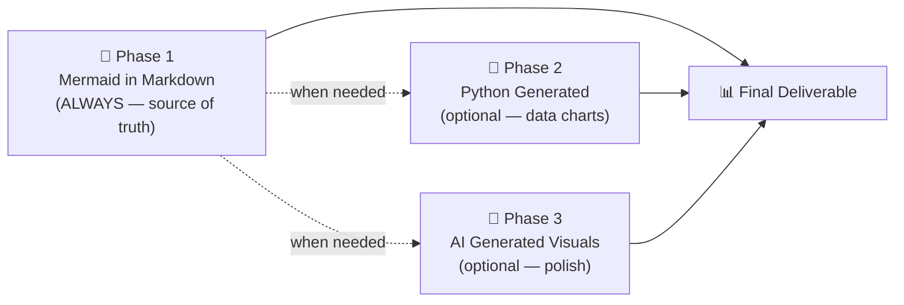
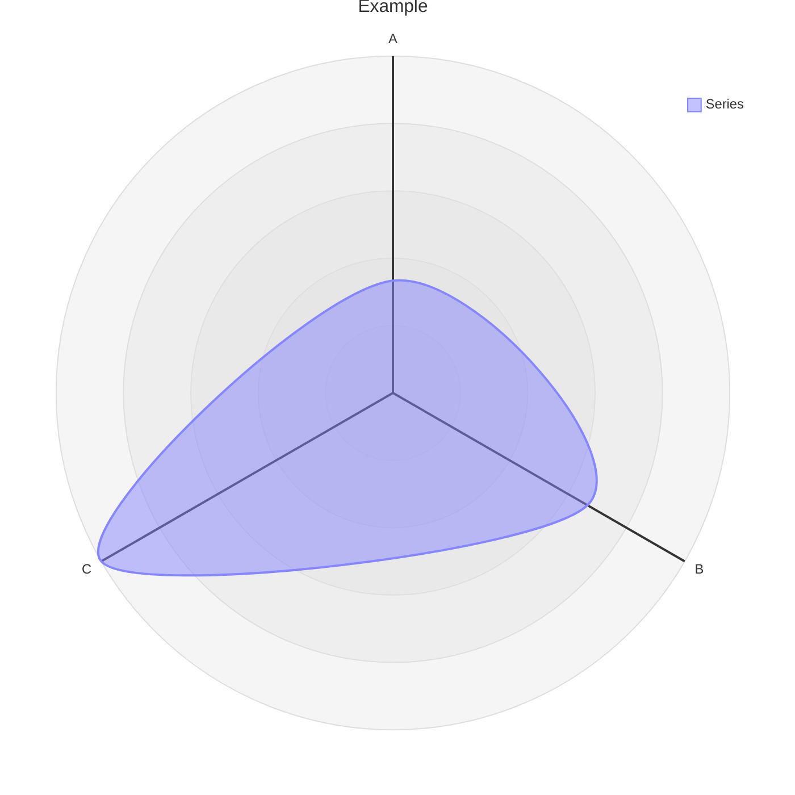

# Markdown and Mermaid Writing

## Overview

This skill teaches you — and enforces a standard for — creating scientific documentation
using **markdown with embedded Mermaid diagrams as the default and canonical format**.

The core bet: a relationship expressed as a Mermaid diagram inside a `.md` file is more
valuable than any image. It is text, so it diffs cleanly in git. It requires no build step.
It renders natively on GitHub, GitLab, Notion, VS Code, and any markdown viewer. It uses
fewer tokens than a prose description of the same relationship.

> "The more you get your reports and files in .md in just regular text, which mermaid is
> as well as being a simple 'script language'. This just helps with any downstream rendering
> and especially AI generated images (using mermaid instead of just long form text to
> describe relationships < tokens)."
>
> — Clayton Young (@borealBytes), K-Dense Discord, 2026-02-19

## When to Use This Skill

Use this skill when:
- Creating **any scientific document** — reports, analyses, manuscripts, methods sections
- Writing **any documentation** — READMEs, how-tos, decision records, project docs
- Producing **any diagram** — workflows, data pipelines, architectures, timelines
- Generating **any output that will be version-controlled**
- Working with **any other skill** — this defines the documentation layer

Do NOT start with Python matplotlib or AI image generation for structural/relational diagrams. Those are Phase 2/3 — only when Mermaid cannot express what's needed.

## The Three-Phase Workflow

**Phase 1 is mandatory.** Mermaid in Markdown is always required and is the source of truth. Phases 2 and 3 are optional downstream conversions.



## Diagram Type Reference (24 types)

| Use case | Diagram type | File |
| -------------------- | ------------ | -------------------------------------------- |
| Experimental workflow / decision logic | Flowchart | `references/diagrams/flowchart.md` |
| Service interactions / API calls | Sequence | `references/diagrams/sequence.md` |
| Data model / schema | ER diagram | `references/diagrams/er.md` |
| State machine / lifecycle | State | `references/diagrams/state.md` |
| Project timeline / roadmap | Gantt | `references/diagrams/gantt.md` |
| Proportions / composition | Pie | `references/diagrams/pie.md` |
| System architecture (zoom levels) | C4 | `references/diagrams/c4.md` |
| Concept hierarchy / brainstorm | Mindmap | `references/diagrams/mindmap.md` |
| Chronological events / history | Timeline | `references/diagrams/timeline.md` |
| Class hierarchy / type relationships | Class | `references/diagrams/class.md` |
| User journey / satisfaction map | User Journey | `references/diagrams/user_journey.md` |
| Two-axis comparison / prioritization | Quadrant | `references/diagrams/quadrant.md` |
| Requirements traceability | Requirement | `references/diagrams/requirement.md` |
| Flow magnitude / resource distribution | Sankey | `references/diagrams/sankey.md` |
| Numeric trends / bar + line charts | XY Chart | `references/diagrams/xy_chart.md` |
| Component layout / spatial arrangement | Block | `references/diagrams/block.md` |
| Work item status / task columns | Kanban | `references/diagrams/kanban.md` |
| Cloud infrastructure / service topology | Architecture | `references/diagrams/architecture.md` |
| Multi-dimensional comparison | Radar | `references/diagrams/radar.md` |
| Hierarchical proportions / budget | Treemap | `references/diagrams/treemap.md` |
| Binary protocol / data format | Packet | `references/diagrams/packet.md` |
| Git branching / merge strategy | Git Graph | `references/diagrams/git_graph.md` |
| Code-style sequence (programming syntax) | ZenUML | `references/diagrams/zenuml.md` |
| Multi-diagram composition patterns | Complex Examples | `references/diagrams/complex_examples.md` |

> 💡 **Pick the right type, not the easy one.** Don't default to flowcharts for everything.

---

## Core Workflow

### Step 1: Identify the document type

| Document type | Template |
| -------------------------- | --------------------------------- |
| Pull request record | `templates/pull_request.md` |
| Issue / bug / feature | `templates/issue.md` |
| Sprint / project board | `templates/kanban.md` |
| Architecture decision (ADR) | `templates/decision_record.md` |
| Presentation / briefing | `templates/presentation.md` |
| Research paper / analysis | `templates/research_paper.md` |
| Project documentation | `templates/project_documentation.md` |
| How-to / tutorial | `templates/how_to_guide.md` |
| Status report | `templates/status_report.md` |

### Step 2: Read the style guides

- **`references/markdown_style_guide.md`** (~733 lines): headings, citations, tables, templates, quality checklist
- **`references/mermaid_style_guide.md`** (~458 lines): accessibility, emoji, color classes, theme neutrality

**Key markdown rules:**
- **One H1 per document** — the title, never more
- **Emoji on H2 headings only** — one emoji per H2, none in H3/H4
- **Cite everything** — every external claim gets a footnote `[^N]` with full URL
- **Tables over prose** for comparisons/structured data
- **Diagrams over walls of text** — if it describes flow or structure, add Mermaid

**Mandatory for every Mermaid diagram:**
```
accTitle: Short Name 3-8 Words
accDescr: One or two sentences explaining what this diagram shows.
```
- **No `%%{init}` directives** — breaks GitHub dark mode
- **No inline `style`** — use `classDef` only
- **`snake_case` node IDs**

## ⚠️ Common Pitfalls

### Radar chart syntax



- Use `radar-beta` not `radar`
- Use `axis` not `x-axis`
- Use `curve` not quoted labels with colon
- No `accTitle/accDescr` — add descriptive italic paragraph above instead

---

## Integration with Other Skills

- **`scientific-schematics`**: Use Mermaid as the brief, generate polished PNG as Phase 3
- **`literature-review`**: Concept maps (Mindmap), timelines (Gantt), methodology comparisons (Quadrant)
- **`scientific-writing`**: Replace prose figures with Mermaid diagrams

---

## Resources

- `references/markdown_style_guide.md` — full markdown formatting standard
- `references/mermaid_style_guide.md` — full Mermaid standard
- `references/diagrams/` — 24 diagram type guides
- `templates/` — 9 document templates
- `assets/examples/example-research-report.md` — full example

---

## Attribution

Content ported from [SuperiorByteWorks-LLC/agent-project](https://github.com/SuperiorByteWorks-LLC/agent-project) under Apache-2.0 License. Author: Clayton Young / @borealBytes.

[^1]: GitHub Blog. "Include diagrams in your Markdown files with Mermaid." https://github.blog/2022-02-14-include-diagrams-markdown-files-mermaid/
[^2]: Mermaid. "Mermaid Diagramming and Charting Tool." https://mermaid.js.org/
